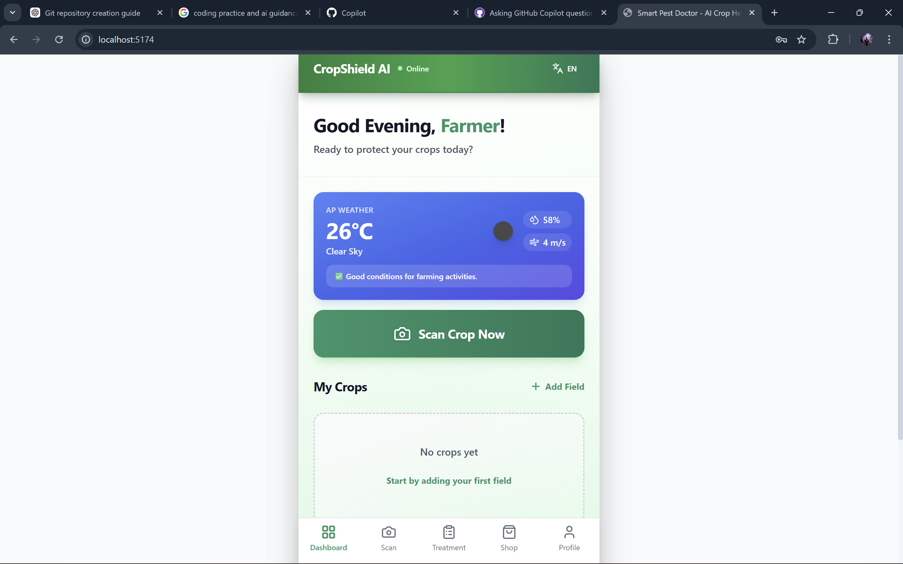
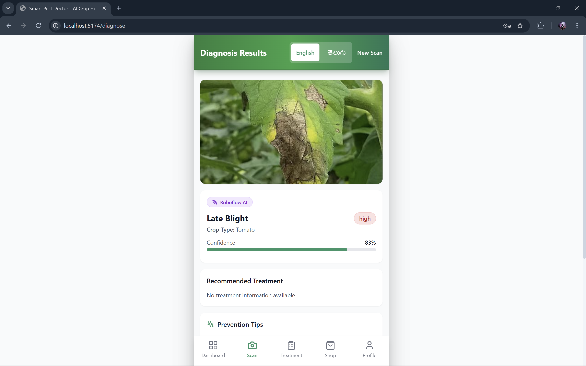
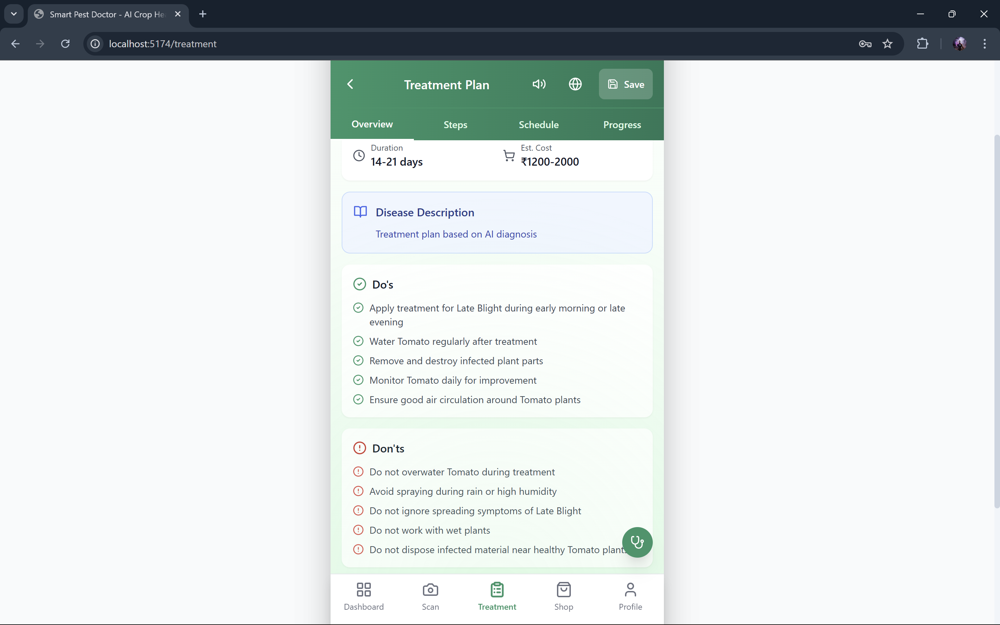
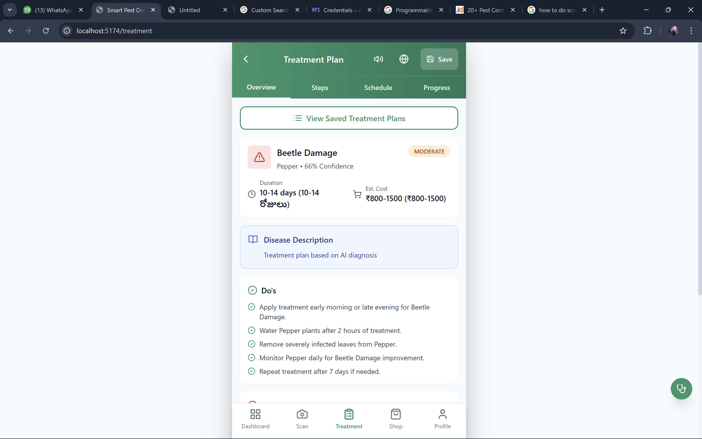
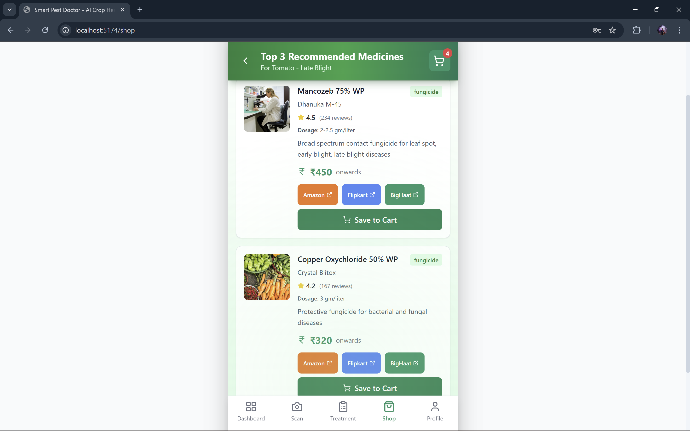

<div align="center">

# 🌿 Pest Scan by AI — Smart Pest Doctor

**AI-powered crop pest detection, treatment planning, and farm monitoring system**

[](LICENSE)
[](https://nodejs.org/)
[](https://reactjs.org/)
[](https://vitejs.dev/)
[](https://www.mysql.com/)

[Demo](#-screenshots) · [Docs](docs/API.md) · [Report Bug](../../issues) · [Request Feature](../../issues)

</div>

---

## 📋 Table of Contents

- [About](#-about)
- [Features](#-features)
- [Tech Stack](#-tech-stack)
- [Screenshots](#-screenshots)
- [Getting Started](#-getting-started)
- [Environment Variables](#-environment-variables)
- [Folder Structure](#-folder-structure)
- [API Documentation](#-api-documentation)
- [Deployment](#-deployment)
- [Contributing](#-contributing)
- [Author](#-author)
- [License](#-license)

---

## 🌾 About

**Pest Scan by AI** is a full-stack web application that empowers farmers and agronomists to:

- **Instantly diagnose** crop diseases and pest infestations by uploading a photo
- **Receive AI-generated treatment plans** with pesticide recommendations and dosage
- **Track field health over time** via visual timelines
- **Connect with expert agronomists** for professional consultations
- **Shop for agricultural products** and track orders
- **Monitor weather conditions** for proactive farm management

The system uses an ensemble of AI models (Google Gemini, Roboflow, Google Vision, Groq, and Hugging Face) with automatic failover for maximum reliability.

---

## ✨ Features

| Feature | Description |
|---|---|
| 🔬 **AI Pest Detection** | Upload a crop image and get instant disease/pest diagnosis |
| 📋 **Treatment Plans** | AI-generated treatment plans with pesticide recommendations |
| 🗺️ **Field Management** | Track multiple farm fields, crops, and health status |
| 📊 **Visual Timeline** | Historical health tracking per field over time |
| 👨‍🌾 **Expert Connect** | Chat and video call with certified agronomists |
| 🛒 **AgriShop** | Browse and purchase agricultural products |
| 🌤️ **Weather Alerts** | Real-time weather monitoring with automated cron alerts |
| 🌍 **Multi-language** | i18n support via react-i18next |
| 🔔 **Push Notifications** | OneSignal push notifications for alerts |
| 📱 **PWA Ready** | Installable as a mobile app on any device |
| 🔒 **Secure Auth** | JWT-based authentication with phone OTP support |
| 🗣️ **Text-to-Speech** | Voice readout of diagnoses and treatments |

---

## 🛠️ Tech Stack

### Frontend
| Technology | Purpose |
|---|---|
| React 18 + Vite | UI framework and build tool |
| Tailwind CSS | Utility-first styling |
| Zustand | Lightweight state management |
| Axios | HTTP client with interceptors |
| react-i18next | Internationalization |
| HeadlessUI | Accessible UI components |

### Backend
| Technology | Purpose |
|---|---|
| Node.js + Express | REST API server |
| Sequelize ORM | MySQL ORM with migrations |
| MySQL 8 | Primary relational database |
| JWT | Authentication tokens |
| Cloudinary | Image upload and storage |
| Winston | Structured logging |
| node-cron | Scheduled jobs (weather sync) |

### AI Services (Ensemble with Failover)
| Service | Role |
|---|---|
| Google Gemini 2.5 | Primary image analysis + treatment generation |
| Roboflow | Plant disease detection model (85%+ accuracy) |
| Google Vision API | Image label detection and backup analysis |
| Groq (Llama 3.1) | Fast LLM for treatment text generation |
| Hugging Face | MobileNet plant disease classification |

### Infrastructure
| Tool | Purpose |
|---|---|
| Docker + Compose | Containerized development and deployment |
| Firebase Admin | Phone OTP verification |
| OneSignal | Push notification delivery |

---

## 📸 Screenshots

### 🏠 Dashboard

> Real-time weather (AP region), quick "Scan Crop Now" CTA, and field overview.

---

### 🔬 AI Diagnosis — Late Blight Detection

> Roboflow AI detects **Late Blight** on Tomato with **83% confidence**.

---

### 💊 Treatment Plan
| Overview (Do's & Don'ts) | Beetle Damage — Pepper |
|---|---|
|  |  |
> AI-generated treatment steps, duration (14-21 days), estimated cost (₹1200-2000), and actionable do's & don'ts.

---

### 🛒 AgriShop — Top Recommended Medicines

> Context-aware product recommendations (Mancozeb 75% WP, Copper Oxychloride) with Amazon / Flipkart / BigHaat buy links.

---

## 🚀 Getting Started

### Prerequisites

- [Node.js 18+](https://nodejs.org/)
- [MySQL 8+](https://www.mysql.com/) (or Docker)
- [Git](https://git-scm.com/)
- API keys for AI services (see [Environment Variables](#-environment-variables))

### 1. Clone the repository

```bash
git clone https://github.com/Komatlakarthik/pest-scan.git
cd pest-scan
```

### 2. Set up the Backend

```bash
cd backend
npm install
cp .env.example .env
# Fill in your API keys in .env
```

### 3. Set up the Database

```bash
# Option A — Docker (recommended)
docker-compose -f infra/docker-compose.yml up -d mysql

# Option B — Local MySQL
mysql -u root -p -e "CREATE DATABASE smart_pest_doctor;"
```

Run database migrations:

```bash
cd backend
npm run migrate
npm run seed   # optional: seed sample data
```

### 4. Set up the Frontend

```bash
cd frontend
npm install
cp .env.example .env
# Set VITE_API_URL to your backend URL
```

### 5. Start Development Servers

```bash
# Terminal 1 — Backend (http://localhost:4000)
cd backend && npm run dev

# Terminal 2 — Frontend (http://localhost:5173)
cd frontend && npm run dev
```

---

## 🔐 Environment Variables

### Backend (`backend/.env`)

Copy `backend/.env.example` → `backend/.env` and fill in the values.

| Variable | Required | Description |
|---|---|---|
| `DB_HOST` / `DB_PASSWORD` | ✅ | MySQL connection |
| `JWT_SECRET` | ✅ | 64-char random string |
| `GEMINI_API_KEY` | ✅ | Google Gemini AI |
| `ROBOFLOW_API_KEY` | ✅ | Roboflow vision model |
| `GOOGLE_VISION_API_KEY` | ✅ | Google Vision API |
| `GROQ_API_KEY` | ✅ | Groq LLM service |
| `CLOUDINARY_URL` | ✅ | Image storage |
| `GOOGLE_APPLICATION_CREDENTIALS` | ✅ | Path to Google service account JSON |
| `HF_API_KEY` | ⚡ Optional | Hugging Face fallback |
| `TWILIO_*` | ⚡ Optional | SMS OTP in production |

### Frontend (`frontend/.env`)

| Variable | Required | Description |
|---|---|---|
| `VITE_API_URL` | ✅ | Backend API base URL |
| `VITE_FIREBASE_API_KEY` | ⚡ Optional | Firebase phone OTP |
| `VITE_OPENWEATHER_API_KEY` | ⚡ Optional | OpenWeather |

> ⚠️ **Never commit `.env` files.** Google service account JSON files are also excluded from git. See `.gitignore`.

---

## 📁 Folder Structure

```
pest-scan/
├── backend/                  # Express API server
│   ├── src/
│   │   ├── config/           # DB, Cloudinary config
│   │   ├── middleware/        # Auth, rate limiter, error handler
│   │   ├── migrations/        # Sequelize DB migrations
│   │   ├── models/            # Sequelize ORM models
│   │   ├── routes/            # API route handlers
│   │   ├── services/          # AI, LLM, product search services
│   │   ├── jobs/              # Cron jobs (weather)
│   │   ├── utils/             # JWT, logger utilities
│   │   └── server.js          # Entry point
│   ├── .env.example           # Environment template
│   └── Dockerfile
│
├── frontend/                 # React + Vite SPA
│   ├── src/
│   │   ├── components/        # Shared UI components
│   │   ├── pages/             # Route-level page components
│   │   ├── store/             # Zustand state stores
│   │   ├── utils/             # Axios instance, weather helpers
│   │   ├── i18n/              # Translations config
│   │   └── App.jsx            # Root component + routing
│   ├── public/
│   └── .env.example           # Frontend env template
│
├── infra/
│   └── docker-compose.yml     # Local dev containers
│
├── docs/
│   ├── API.md                 # Full API reference
│   ├── DEPLOYMENT.md          # Deployment guide
│   └── PRODUCT_SEARCH.md
│
├── postman/                   # Postman collection
├── .gitignore
└── README.md
```

---

## 📖 API Documentation

Full API reference is available in [docs/API.md](docs/API.md).

Key endpoints:

| Method | Endpoint | Description |
|---|---|---|
| POST | `/api/auth/send-otp` | Send phone OTP |
| POST | `/api/auth/verify-otp` | Verify OTP and login |
| POST | `/api/detect` | Upload image and get AI diagnosis |
| GET | `/api/treatment/:id` | Get treatment plan |
| GET/POST | `/api/fields` | Manage farm fields |
| GET | `/api/weather/:fieldId` | Get field weather data |
| GET | `/api/shop/products` | Browse agri products |

---

## 🚢 Deployment

See [docs/DEPLOYMENT.md](docs/DEPLOYMENT.md) for detailed instructions.

**Recommended free-tier stack:**

| Service | Component | Plan |
|---|---|---|
| [Railway](https://railway.app) | Backend + MySQL | Starter (free) |
| [Vercel](https://vercel.com) | Frontend | Hobby (free) |
| [Cloudinary](https://cloudinary.com) | Image storage | Free 25GB |
| [PlanetScale](https://planetscale.com) | MySQL (alternative) | Free hobby |

---

## 🤝 Contributing

1. Fork the repository
2. Create a feature branch: `git checkout -b feat/your-feature-name`
3. Commit using [Conventional Commits](https://www.conventionalcommits.org/): `git commit -m "feat: add your feature"`
4. Push and open a Pull Request

Please read the [Contributing Guide](CONTRIBUTING.md) and respect the [Code of Conduct](CODE_OF_CONDUCT.md).

---

## 👤 Author

**Built with ❤️ for farmers**

- GitHub: [@Komatlakarthik](https://github.com/Komatlakarthik)
- Project: [https://github.com/Komatlakarthik/pest-scan](https://github.com/Komatlakarthik/pest-scan)

---

## 📄 License

This project is licensed under the **MIT License** — see the [LICENSE](LICENSE) file for details.

---

<div align="center">
⭐ Star this repo if it helped you! ⭐
</div>
